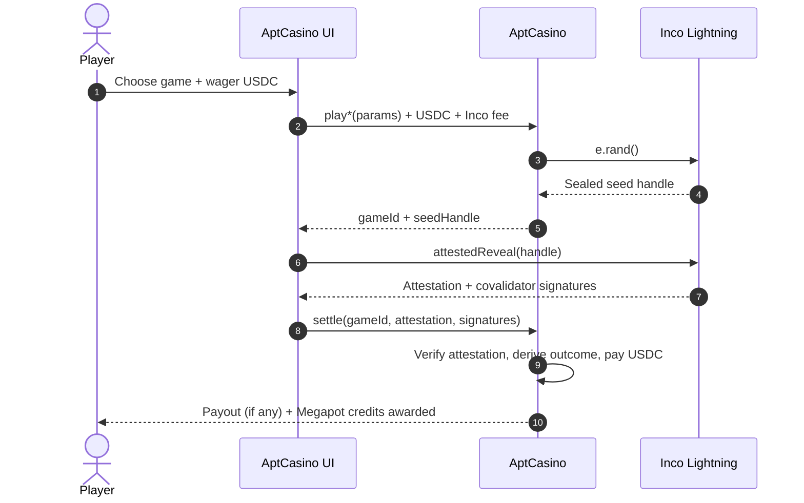
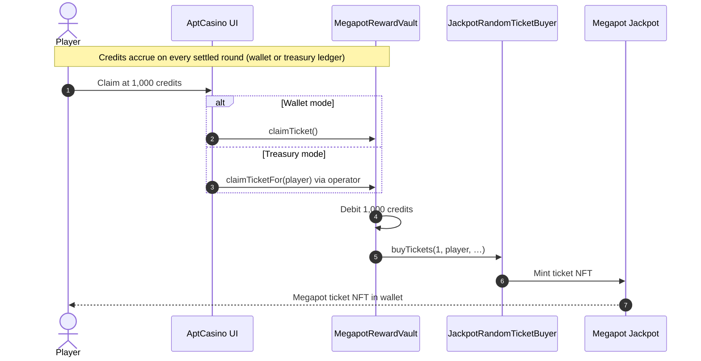
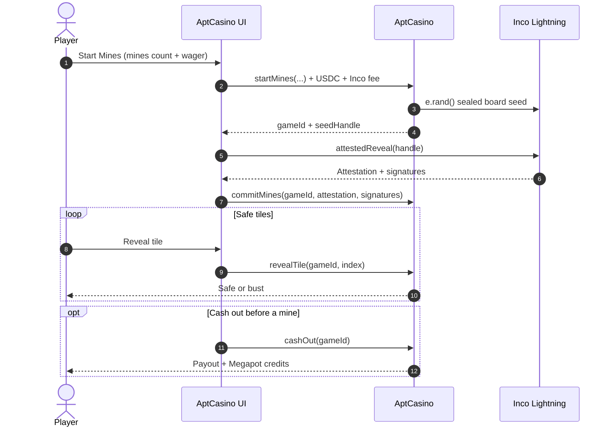

# AptCasino

Confidential casino on **Base Sepolia** powered by **Inco Lightning** (attested randomness) and **Megapot** (gameplay → lottery ticket NFTs).

**Live demo:** [https://aptcasino-inco-gamma.vercel.app](https://aptcasino-inco-gamma.vercel.app)

> Testnet only. Balances, tickets, and USDC here are Base Sepolia assets — not mainnet value.

## One-line pitch

Play confidential casino games on Base with Inco-attested fairness — every round earns Megapot lottery tickets.

## Core gameplay loop

```text
Wager USDC
  → AptCasino play*  (e.rand() sealed seed + Inco fee)
  → Inco covalidator attestedReveal
  → settle(gameId, attestation, signatures)
  → USDC payout (if any) + Megapot credits
  → at 1,000 credits → claim Megapot ticket NFT
```

Inco settles the round. Megapot is the progression reward inside that same loop — not a marketing link-out.

Deep dive with more diagrams: [`howto.md`](./howto.md)

## Sequence diagrams

### Inco play → attested reveal → settle

Roulette / Wheel / Plinko (wallet mode). Treasury mode uses the same contract calls; the server treasury is `msg.sender`.



### Megapot credits → ticket claim



### Mines (multi-step session)



## Games

| Game | Confidential mechanic |
| --- | --- |
| **Roulette** | Attested wheel outcome; multi-chip table (straight, even-money, dozen/column, covered numbers) |
| **Wheel** | Attested landing segment; low / medium / high risk tables |
| **Plinko** | Attested left/right path → verified bucket + multiplier |
| **Mines** | Sealed board seed → commit → tile reveals / cashout |

## Play modes

| Mode | Who signs | UX |
| --- | --- | --- |
| **Treasury** (default) | Server treasury wallet | Deposit USDC once, then play without signing every round |
| **Wallet** | Player wallet | Approve + play + settle from the connected account |

Both modes use the same on-chain randomness verification and payout math.

## Stack

- **Frontend:** Next.js App Router, ConnectKit, wagmi/viem, `@inco/lightning-js`
- **Contracts:** Foundry / Hardhat workspace under `contracts/` — `AptCasino.sol`, `MegapotRewardVault.sol`
- **Network:** Base Sepolia (`84532`)
- **Data:** Supabase (history, leaderboards, treasury ledger, Megapot off-chain credits)

## Deployed contracts (Base Sepolia)

| Contract | Address |
| --- | --- |
| AptCasino | [`0xa9B94c3F2Cf7110AA7425618362FCC2643316B25`](https://sepolia.basescan.org/address/0xa9B94c3F2Cf7110AA7425618362FCC2643316B25) |
| MegapotRewardVault | [`0x7Ec9088C4A9Bf88dC38FEdb649FD7303E5391ea9`](https://sepolia.basescan.org/address/0x7Ec9088C4A9Bf88dC38FEdb649FD7303E5391ea9) |
| USDC | [`0x036CbD53842c5426634e7929541eC2318f3dCF7e`](https://sepolia.basescan.org/address/0x036CbD53842c5426634e7929541eC2318f3dCF7e) |
| Megapot Jackpot | `0x465dA3c859f193A3807386387bEE941B2A4c3279` |
| JackpotRandomTicketBuyer | `0x53c04e7e5044B28Ea8A4F9c4b26E3Ac1aeb63746` |

Ticket buys currently pass empty referrer / referral-split arrays (testnet).

## Local development

```bash
npm install
cp .env.example .env   # or .env.local
npm run dev
```

Open [http://localhost:3000](http://localhost:3000).

### Required environment

See [`.env.example`](./.env.example). Important keys:

| Variable | Purpose |
| --- | --- |
| `NEXT_PUBLIC_APTCASINO_ADDRESS` | Deployed casino |
| `NEXT_PUBLIC_MEGAPOT_REWARD_VAULT_ADDRESS` | Credit vault |
| `NEXT_PUBLIC_SUPABASE_URL` / keys | History, leaderboard, treasury ledger |
| `NEXT_PUBLIC_TREASURY_ADDRESS` | Custodial deposit address |
| `TREASURY_PRIVATE_KEY` | **Server-only** — signs treasury plays (never expose to the client) |
| `NEXT_PUBLIC_SITE_URL` | Canonical origin (OG / share links) |

### Contracts

```bash
npm --prefix contracts install
npm run contracts:compile
cp contracts/.env.example contracts/.env
npm run contracts:deploy:testnet
```

The deployer needs Base Sepolia ETH (gas + Inco fees) and USDC for bankroll. `MegapotRewardVault` needs test USDC before ticket claims succeed.

## Documentation & links

| Doc | Link |
| --- | --- |
| How Inco + Megapot work in this app | [`howto.md`](./howto.md) |
| Inco games overview | https://docs.inco.org/games/overview |
| Incasino (play → settle) | https://docs.inco.org/games/incasino |
| Inco Mines | https://docs.inco.org/games/mines |
| Megapot LLM / agent entry | https://llms.megapot.io/ |
| Megapot protocol | https://docs.megapot.io/build-on-megapot/build/protocol-reference |

Agent tooling in-repo: `.agents/skills/lightning`, `.cursor/skills/megapot`, `.cursor/rules/inco-megapot.mdc`.

## Summer Game Jam note

Built for the Inco + Megapot Summer Game Jam on Base Sepolia. Pre-existing AptCasino brand/UI patterns were adapted; the confidential Inco settle path and Megapot credits→ticket loop were implemented for this jam. See the submission disclosure for details.

## License / conduct

See [`CODE_OF_CONDUCT.md`](./CODE_OF_CONDUCT.md).
