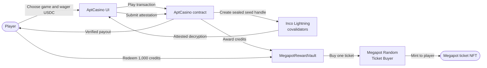
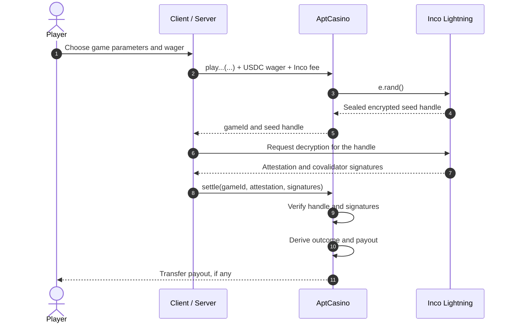
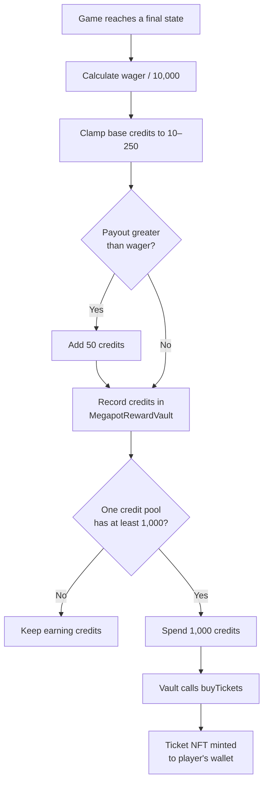
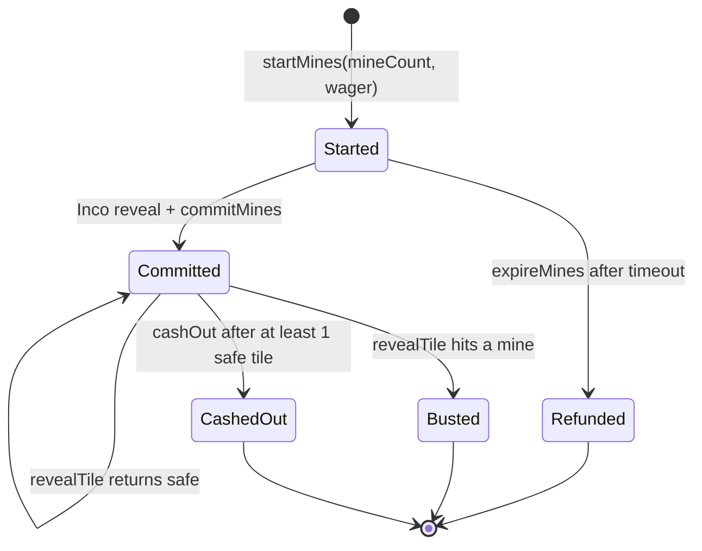
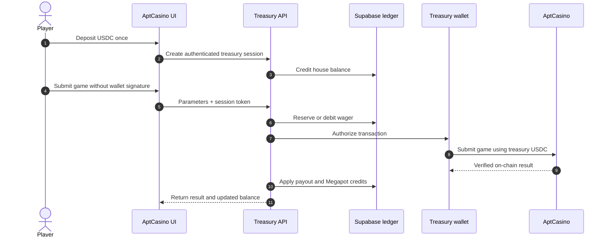

# How Inco and Megapot Work in AptCasino

AptCasino is a confidential casino running on **Base Sepolia**. Players wager and receive payouts in **USDC**. Randomness is generated through **Inco Lightning**, while every completed game earns credits that can be redeemed for **Megapot lottery ticket NFTs**.

**Live website:** [https://aptcasino-inco-gamma.vercel.app/](https://aptcasino-inco-gamma.vercel.app/) · **GitHub:** [AptCasino-Inco](https://github.com/AmaanSayyad/AptCasino-Inco) · **Deck:** [Figma](https://www.figma.com/deck/vcXvmRFqhTN5Sj85ZrYf1i/AptCasino-Inco-x-Megapot) · **Contact:** [amaansayyad2001@gmail.com](mailto:amaansayyad2001@gmail.com) · **Repo overview:** [`README.md`](./README.md)

> [!IMPORTANT]
> AptCasino currently runs on a testnet. Testnet assets and ticket NFTs do not represent mainnet funds or guaranteed real-world value.

## Contents

- [System overview](#system-overview)
- [Play modes](#play-modes)
- [How Inco works](#how-inco-works)
- [How Megapot works](#how-megapot-works)
- [Game-by-game breakdown](#game-by-game-breakdown)
- [Treasury mode](#treasury-mode)
- [Contracts and verification](#contracts-and-verification)

## System overview



The browser or server coordinates transactions, but it does **not** choose the outcome. The AptCasino smart contract accepts an outcome only after validating the Inco attestation on-chain.

## Play modes

| Mode | Who signs game transactions? | Where USDC lives | Typical wallet interaction |
| --- | --- | --- | --- |
| **Wallet mode** | Player's wallet | Player wallet, then AptCasino during the wager | Player signs approvals and game transactions |
| **Treasury mode** (default) | Server treasury wallet | Off-chain house-balance ledger backed by the treasury | Deposit once, then play without signing every round |

Both modes use the same smart contract, randomness verification, and payout calculations. Only the signer and balance-accounting path change.

## How Inco works

Inco provides confidential, verifiable randomness through a shared three-stage pattern.



### Settlement stages

| Stage | What happens | Trust boundary |
| --- | --- | --- |
| **1. Bet** | USDC is locked and the contract requests a sealed seed with `e.rand()` | Nobody can read the random value yet |
| **2. Reveal** | `@inco/lightning-js` requests an attested decryption | The response is tied to the exact encrypted handle |
| **3. Settle** | The attestation and signatures are submitted to AptCasino | Invalid handles or signatures revert |
| **4. Resolve** | The contract calculates the result, pays winnings, and awards credits | Contract events become the source of truth |

```text
Approving USDC → Locking wager → Waiting for covalidators
              → Verifying attestation → Settled
```

### Why this is verifiable

- The browser never selects the winning number, segment, bucket, or mine layout.
- The server cannot replace the seed because the attestation must match the stored handle.
- AptCasino verifies the Inco covalidator signatures before using the revealed value.
- Game outcomes and payouts are emitted as on-chain events.

## How Megapot works

Megapot is a reward layer on top of normal casino payouts. It does not determine game outcomes.

### Earning credits

When a round fully settles, `AptCasino.sol` calls `MegapotRewardVault.award(...)`.

| Rule | Credit calculation |
| --- | ---: |
| Base amount | `wager / 10,000` |
| Minimum per completed round | 10 credits |
| Maximum base amount per completed round | 250 credits |
| Winning bonus when `payout > wager` | +50 credits |
| Ticket redemption cost | 1,000 credits |

USDC uses 6 decimals, so approximately **0.01 USDC** produces one raw credit before the minimum and maximum limits are applied.



### Credit pools

| Play mode | Where credits accumulate | Claim path |
| --- | --- | --- |
| **Wallet mode** | `MegapotRewardVault.credits(player)` on-chain | Player calls `claimTicket()` |
| **Treasury mode** | Per-player balance in Supabase; pooled on-chain under the treasury signer | Server debits 1,000 credits, then calls `claimTicketFor(player)` |

The UI displays the sum of both pools so progress remains visible when switching modes. However, **1,000 credits must exist in one individual pool** before that pool can fund a claim.

### Claiming a ticket

1. The selected pool spends 1,000 credits.
2. `MegapotRewardVault` reads the current ticket price.
3. The vault spends its USDC through Megapot's `buyTickets(...)` integration.
4. Megapot mints the ticket NFT directly to the player's wallet.

Referral and referral-split arrays are intentionally empty for these purchases.

## Game-by-game breakdown

### Summary

| Game | Session model | Outcome derived from seed | Credit trigger |
| --- | --- | --- | --- |
| **Roulette** | `playRoulette → settle` | `seed % 37` | `settle(...)` |
| **Wheel** | `playWheel → settle` | `seed % segments` | `settle(...)` |
| **Plinko** | `playPlinko → settle` | Seed bit walk → bucket | `settle(...)` |
| **Mines** | `startMines → commitMines → revealTile...` | Fisher–Yates shuffle → private mine map | `cashOut(...)` or mine hit |

### Roulette

**Contract flow:** `playRoulette(bets[]) → settle(gameId, attestation, signatures)`

The contract calculates `seed % 37` to produce a winning number from 0 through 36. Each chip is evaluated independently, and one round can contain up to 10 chips.

| Bet type | Covered outcome | Gross multiplier before house edge |
| --- | --- | ---: |
| Straight | One number | 36× |
| Red/Black, Odd/Even, High/Low | One of two groups | 2× |
| Dozen or Column | One of three groups | 3× |
| Split, Street, Corner, Six-line | 2, 3, 4, or 6 supplied numbers | `36 / covered-number count` |

All Roulette payouts apply the 3% house edge multiplier (`× 0.97`).

### Wheel

**Contract flow:** `playWheel(risk, segments, wager) → settle(...)`

| Parameter | Supported values |
| --- | --- |
| Risk | `0` Low, `1` Medium, `2` High |
| Segments | 10, 20, 30, or 40 |

The contract calculates `seed % segments`, maps the segment to a multiplier lane, and pays:

```text
payout = wager × multiplierBps / 10,000
```

High risk can pay up to 10×. The wheel animation is cosmetic; the emitted `WheelOutcome` event is authoritative.

### Plinko

**Contract flow:** `playPlinko(risk, rows, wager) → settle(...)`

| Parameter | Supported values |
| --- | --- |
| Risk | Low, Medium, or High |
| Rows | 8–16 |

For every row, one seed bit determines left or right:

```text
direction at row i = (seed >> i) & 1
bucket index = total number of right moves
```

The bucket's distance from the center determines the multiplier. High-risk edge buckets can pay up to 16×. The Matter.js animation follows the contract result; it does not generate it.

### Mines

Mines is a multi-transaction session rather than a single `play → settle` round.



#### Phase 1 — Start and commit

1. `startMines(mineCount, wager)` locks USDC and creates a sealed Inco seed.
2. The client requests the attested reveal.
3. `commitMines(gameId, attestation, signatures)` verifies it.
4. The contract derives mine positions on a 5×5 grid with a Fisher–Yates-style shuffle.

Mine positions stay in contract storage during play and are not emitted until the session ends.

#### Phase 2 — Reveal tiles

- Every click calls `revealTile(gameId, tile)`.
- A safe tile increases the revealed count and potential payout.
- A mine ends the session with zero payout and emits `MinesBusted`.
- The mine count can be set from 1 to 24.

#### Phase 3 — Cash out

- `cashOut(gameId)` is available after at least one safe tile.
- Payout follows the combinatorial odds of selecting safe tiles from a `25 - mineCount` pool.
- A 3% house edge is applied.
- Cashing out emits `MinesCashedOut` and awards Megapot credits.

| Treasury Mines action | Endpoint |
| --- | --- |
| Start and commit | `/api/treasury/mines/start` |
| Reveal a tile | `/api/treasury/mines/reveal` |
| Cash out | `/api/treasury/mines/cashout` |

## Treasury mode

Treasury mode reduces repeated wallet prompts by using a custodial house balance.



The treasury hot wallet needs Base Sepolia ETH for gas and Inco fees, plus approved USDC for wagers. The player's ledger balance mirrors the verified on-chain result.

> [!NOTE]
> Treasury mode introduces custody and server-ledger trust for balances. It does not change randomness verification or payout formulas.

## Contracts and verification

### Base Sepolia contracts

| Component | Address |
| --- | --- |
| AptCasino | [`0xa9B94c3F2Cf7110AA7425618362FCC2643316B25`](https://sepolia.basescan.org/address/0xa9B94c3F2Cf7110AA7425618362FCC2643316B25) |
| MegapotRewardVault | [`0x7Ec9088C4A9Bf88dC38FEdb649FD7303E5391ea9`](https://sepolia.basescan.org/address/0x7Ec9088C4A9Bf88dC38FEdb649FD7303E5391ea9) |
| USDC | [`0x036CbD53842c5426634e7929541eC2318f3dCF7e`](https://sepolia.basescan.org/address/0x036CbD53842c5426634e7929541eC2318f3dCF7e) |
| Megapot Jackpot | `0x465dA3c859f193A3807386387bEE941B2A4c3279` |
| Megapot Random Ticket Buyer | `0x53c04e7e5044B28Ea8A4F9c4b26E3Ac1aeb63746` |

Addresses match `.env.example` / the live Vercel deployment. Always confirm against Basescan if redeploying.

### Responsibilities

| Component | Responsibility |
| --- | --- |
| `AptCasino.sol` | Locks wagers, verifies attestations, calculates results and awards credits |
| `MegapotRewardVault.sol` | Stores on-chain credits and redeems them for tickets |
| Inco Lightning | Produces sealed randomness and the covalidator-attested reveal |
| Megapot contracts | Sell and mint Base Sepolia ticket NFTs |
| Supabase treasury ledger | Tracks custodial USDC balances and treasury-mode credits |

### Verify a round

Open [Base Sepolia Basescan](https://sepolia.basescan.org) and search for the settlement transaction hash shown in the UI.

| Game | Outcome or final-state events |
| --- | --- |
| Roulette | `RouletteOutcome`, `BetSettled` |
| Wheel | `WheelOutcome`, `BetSettled` |
| Plinko | `PlinkoOutcome`, `BetSettled` |
| Mines | `MinesCashedOut` or `MinesBusted`, plus `BetSettled` |

These event values are the on-chain source of truth for the final outcome and payout.
